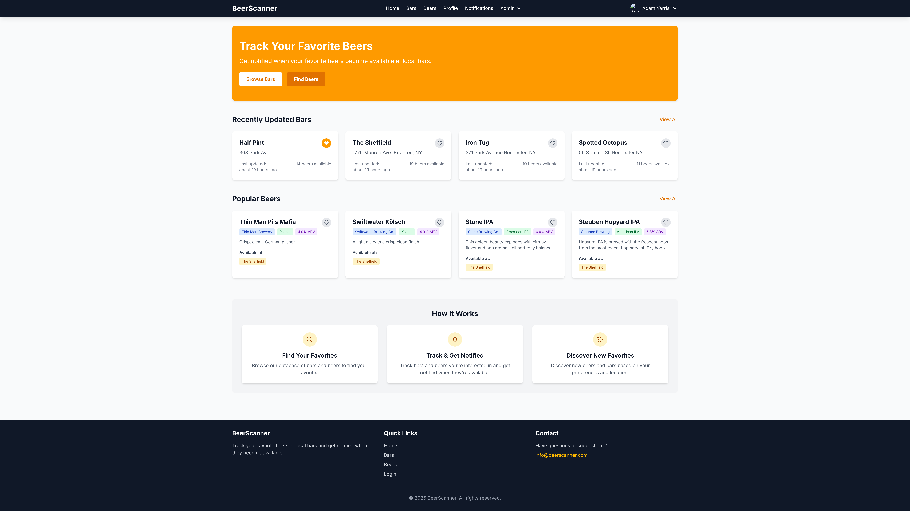
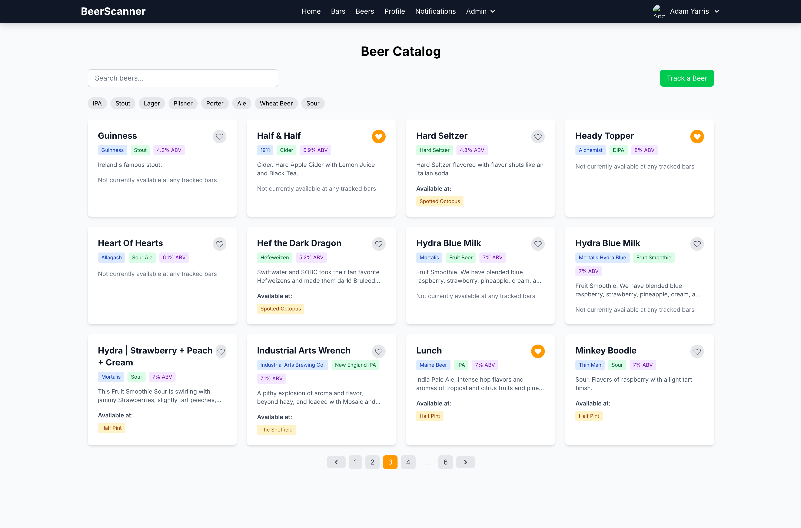
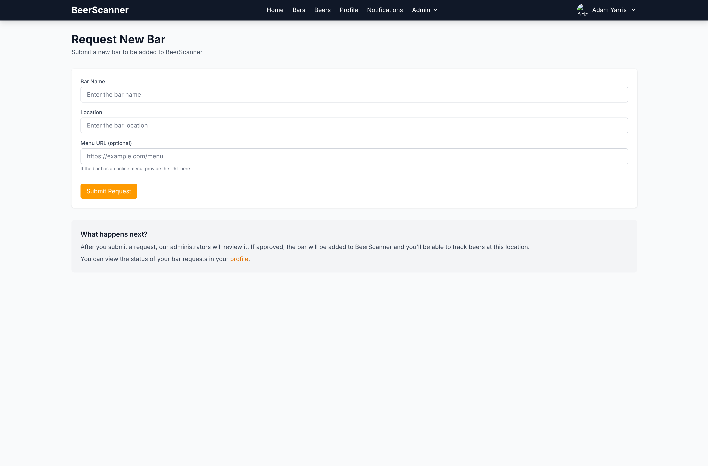
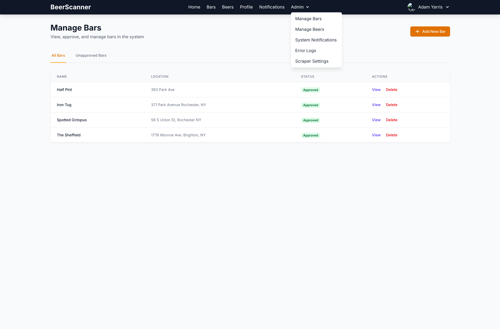
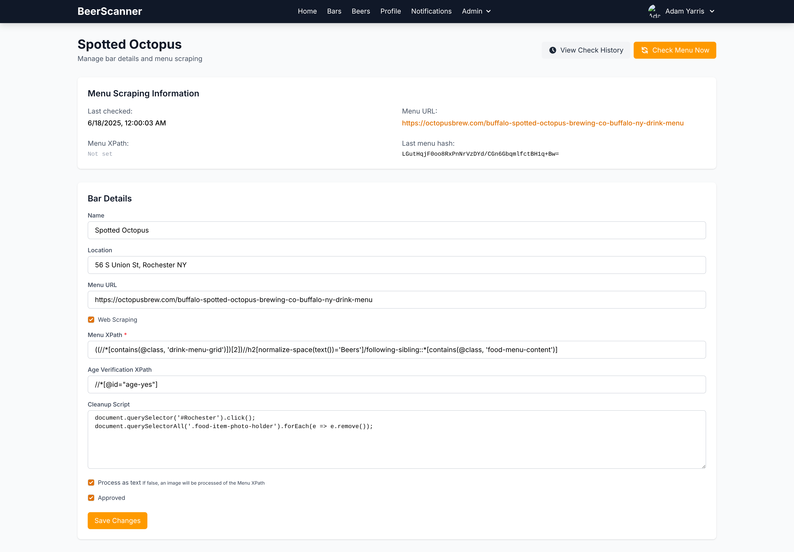
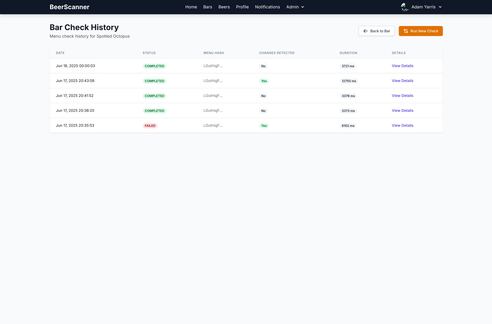

# Beer Scanner

A website that tracks beer availability at bars automatically. You can get notifications when bars change their menu, when any specific beer is available (at specific bars or anywhere near you). This is an alternative to Untappd, which is great, only if the bar reports their menu, or if users report they are drinking something specific at a bar.

Beer Scanner supports **all** bars, utilizing [OpenAI 4.1-mini](https://platform.openai.com/docs/models/gpt-4.1-mini) alongside Selenium (when needed) and significant preprocessing, using the following techniques, depending on how the bar provides their menu:

- Scanning image or PDF menus
- Extracting beers from parsed HTML
- Scanning a preprocessed image of the bar's web menu

Administrators can easily set up how a bar should be tracked, with each check only costing a small fraction of a cent **if** the menu changed.


> [!NOTE]
> This project is a WIP. Most features are fully implemented, but more are planned & needs to be polished up. This will be publicly hosted for everyone to use once it is "done"

## Features

- Track beer availability at bars
- Daily checks of bar menus using OpenAI to extract beer information
- User authentication via Google OAuth
- Notifications for beer availability and menu changes
- Search functionality for bars and beers
- User preferences for tracking specific bars and beers
- Requesting new bars and beers to be added, with an admin approval process

## Technology Stack

- **Backend**: Spring Boot
- **Frontend**: TypeScript/Svelte
- **Database**: PostgreSQL
- **Authentication**: OAuth2 with Google
- **AI Integration**: OpenAI API for menu parsing
- **Web Scraping**: Selenium

## Screenshots

The following are some screenshots of some of the core functionality of Beer Scanner.














## Running with Docker

The application is containerized using Docker and can be easily run using Docker Compose.

Instructions are a TODO

### Prerequisites

- Docker and Docker Compose installed
- Google OAuth credentials (Client ID and Secret)
- OpenAI API key

### Environment Variables

Create a `.env` file in the root directory with the following variables:

```
GOOGLE_CLIENT_ID=your_google_client_id
GOOGLE_CLIENT_SECRET=your_google_client_secret
OPENAI_API_KEY=your_openai_api_key
JWT_SECRET=your_jwt_secret
FRONTEND_URL=http://localhost:3000
MAIL_USERNAME=your_email_username
MAIL_PASSWORD=your_email_password
SELENIUM_HUB_URL=http://localhost:4444/wd/hub
```
